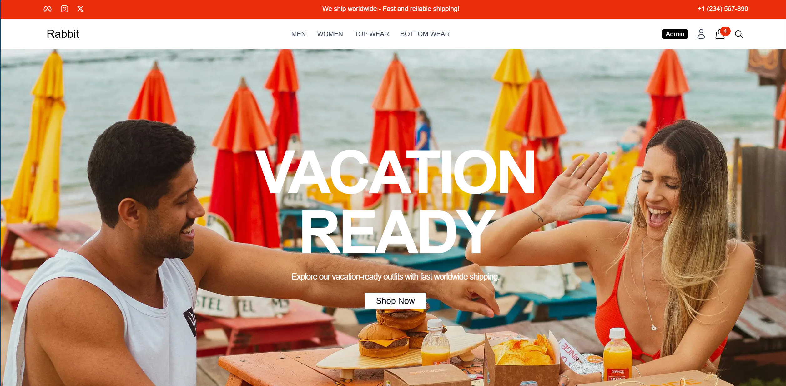

# 🛒 E-commerce MERN Stack Application

This is a **fully functional e-commerce website** built with the **MERN stack** (MongoDB, Express.js, React.js, Node.js). It features secure authentication, admin functionality, image uploads, payment processing, and a modern responsive UI.

This project serves as a **real-world, full-stack application** — perfect for demonstrating development skills and deepening your understanding of modern web technologies.

🚀 **Live Demo**: 👉 [mern-frontend-tau-two.vercel.app](https://mern-frontend-tau-two.vercel.app/) 👈





---

## ✨ Key Features

- **🔐 User Management**  
  Secure registration and login with JWT-based authentication.  
  Profile management and admin user controls.

- **🛍️ Product Catalog**  
  Browse, search, and filter products.  
  Admin functionality for product creation and management.

- **🛒 Shopping Cart**  
  Add, update, and remove items with real-time cart updates.

- **📦 Order Processing**  
  Place orders, view order history, and manage orders (admin).

- **📸 Image Uploads**  
  Integrated with Cloudinary for product image hosting.

- **💳 Payment Integration**  
  Secure PayPal payments with order confirmation flow.

- **📱 Responsive Design**  
  Built with Tailwind CSS for a modern and mobile-friendly UI.

- **🧠 State Management**  
  Efficient global state handling using Redux Toolkit and Redux Thunk.

---

## 🚀 Technologies Used

### 🔧 Frontend

- **React.js** – Component-based UI library  
- **Redux Toolkit & Redux Thunk** – State management  
- **Tailwind CSS** – Utility-first CSS framework  
- **Axios** – Promise-based HTTP client

### ⚙️ Backend

- **Node.js & Express.js** – Server-side runtime and framework  
- **MongoDB & Mongoose** – NoSQL database and data modeling  
- **JSON Web Tokens (JWT)** – Authentication system  
- **Bcrypt.js** – Password hashing  
- **Cloudinary** – Cloud-based image hosting  
- **Nodemailer** – Email functionality (e.g., password reset)  
- **Dotenv** – Environment variable configuration

---

## 🏁 Getting Started

To run this project locally:

1. Clone the repo
2. Install dependencies in both `/client` and `/backend`
3. Set up `.env` files for backend and frontend
4. Run the app using:

```bash
# In the root folder:
npm install && npm run dev
